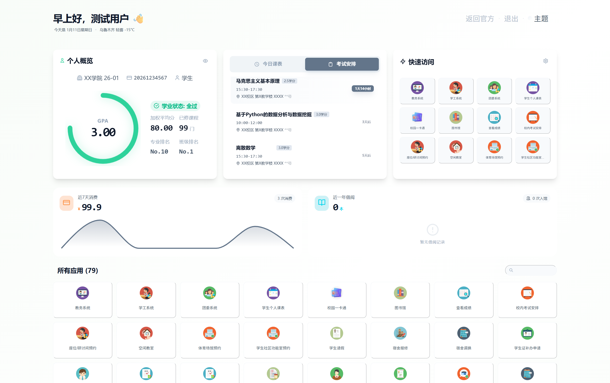

<div align="center">
  <h1>Better-XJU</h1>

  <p>
    
    
   
    
    
    
  </p>

  <p>
    <b>更优雅的新疆大学学生后台使用体验<br>
  </p>

  <p>
    基于 Chrome Extension MV3 架构，通过底层协议重构与多级缓存机制，<br>
    打破教务系统、办事大厅与OneTable平台的数据孤岛，享受飞一般的学生后台使用体验。
  </p>
</div>

<br>

## 界面预览

<div align="center">
    
</div>

<br>

## 核心设计架构

本项目采用 **"Hybrid Triad" (混合三元)** 架构，通过构建标准化的中间层，解决校内多代际系统间的数据标准不统一问题：

### 1. 遗留系统兼容与协议标准化 (Legacy System Adaptation)
针对基于 Web 1.0 技术栈的教务系统（Kingosoft），构建了专用兼容层以确保数据交互的稳定性：
*   **请求头规范化**：通过 `declarativeNetRequest` API 对请求头（Headers）进行标准化修饰，修正 Origin 与 Referer 标识，确保请求符合服务器端的安全验证规则。
*   **编码透传处理**：内置 GBK 字符集处理引擎，采用二进制流（ArrayBuffer）方式对接老旧接口，彻底解决非 UTF-8 环境下的中文乱码问题。
*   **服务层直连**：绕过不稳定的前端展示层逻辑，直接与后端 `DataTable.jsp` 数据接口通信，在保障数据准确性的同时显著提升查询成功率。

### 2. 跨域身份互通 (Cross-System Interoperability)
*   **会话状态同步**：针对一张表平台（OneTable）的 JWT 认证机制，建立了安全的上下文通信桥梁，自动同步当前用户的认证状态（Token），实现无缝的跨域数据访问。
*   **统一认证复用**：深度集成学校 CAS 统一认证体系，在本地复用浏览器已有的登录凭据，无需用户二次授权即可打通多平台数据权限。

### 3. 极致性能与低负载 (Performance & Efficiency)
*   **多级缓存策略**：构建 LocalStorage 与 IndexedDB 混合缓存架构，实现应用的秒级冷启动与即时响应。
*   **按需增量更新**：引入数据指纹比对机制，系统仅在检测到远程数据变更时触发更新与渲染，最大程度减少对学校服务器的请求压力。

---

## 功能模块

| 模块名称 | 数据源 | 功能描述 |
|:---|:---|:---|
| **学业概览** | 教务系统/OT | 整合加权平均分、GPA，专业/班级排名以及已修读课程情况。 |
| **智能课表** | 教务系统 | 自动锚定学期校历，精准计算当前周次与精确到分钟的实时课程。 |
| **生活看板** | OneTable | 聚合近 7 日消费趋势图表、图书馆借阅状态与出入记录。 |
| **考试追踪** | 教务系统 | 动态获取考场安排、座位编号，内置倒计时预警。 |
| **快速访问** | 办事大厅 | 解析门户 JSON 配置，提供用户有权访问的所有微服务的模糊搜索与免登跳转。 |

---

## 安装方法

### 方案一：Chrome 应用店（推荐）
*审核中，敬请期待...*

### 方案二：预编译包安装
1.  前往 [Releases](https://github.com/soundstarrain/Better-XJU/releases) 下载最新的 `dist.zip` 并解压。
2.  在 Chrome 地址栏访问 `chrome://extensions/` 并开启右上角的 **开发者模式**。
3.  点击 **加载已解压的扩展程序**，选择解压出的 `dist` 目录。

### 方案三：源码构建
```bash
git clone https://github.com/soundstarrain/Better-XJU.git
cd Better-XJU
npm install
npm run build
```

---

## 隐私与安全协议

Better-XJU 将用户数据安全视为最高优先级：
*   **纯本地化处理**：所有教务数据均在用户浏览器本地解析（Local Storage/IndexedDB），**不设任何中转服务器**，开发者无法获取任何用户信息。
*   **会话级安全**：直接复用用户现有的 CAS 登录态，**不触碰、不存储**用户的明文密码。
*   **开源透明**：所有代码均在 GitHub 开源，欢迎社区审计。

---

## ⚠️ 风险提示与免责声明

> **在下载、安装、使用本扩展程序前，请务必仔细阅读以下条款。一旦您开始使用，即视为您已完全理解并同意本声明。**

### 1. 软件性质
本项目为非官方的、开源的个人学习研究项目，仅供技术交流与学习使用。**本项目与新疆大学（XJU）及其相关行政部门、官方教务系统供应商无任何关联。**

### 2. 数据准确性
本扩展程序的数据来源于学校官方系统接口。虽然我们尽力确保数据的实时性与准确性，但由于官方系统接口变动、网络波动或缓存机制等不可控因素，**本程序展示的信息仅供参考**。
*   **重要决策（如选课、考试时间、学分核对等）请务必以学校官方教务系统网页版显示的信息为准。**
*   因依赖本程序数据而导致的任何学业损失（包括但不限于迟到、缺考），开发者不承担任何法律责任。

### 3. 使用与修改规范
*   **合规性设计**：本程序核心逻辑已内置多级缓存机制，正常使用官方发布版本旨在**降低**学校服务器负载，不存在高频抓取或恶意攻击行为。
*   **禁止恶意篡改**：作为开源项目，严禁用户对源代码进行恶意修改（如移除缓存限制、修改请求参数构建）以实施压力测试或数据爬取等危害学校网络安全的行为。

## 许可证
Copyright (c) 2026 soundstarrain.
Licensed under the [GNU General Public License v3.0](https://www.gnu.org/licenses/gpl-3.0).
